Patika.dev 
Java 102 Project Tourism Agency

1-Login Screen

2-User Not Found

3-Admin Panel

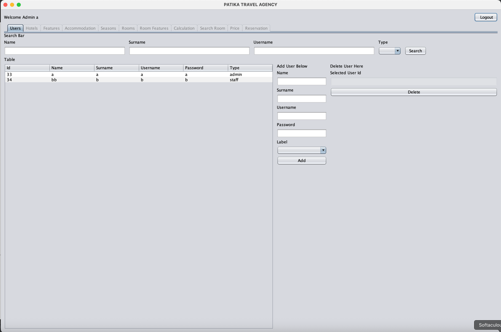

4-Staff Panel

4-1 Hotel

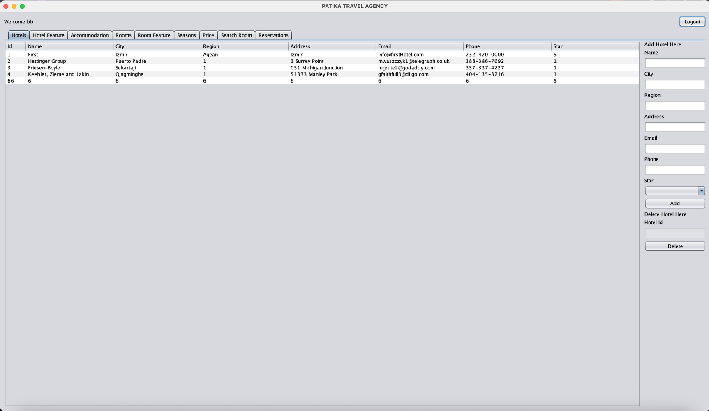

4-2 Hotel Features

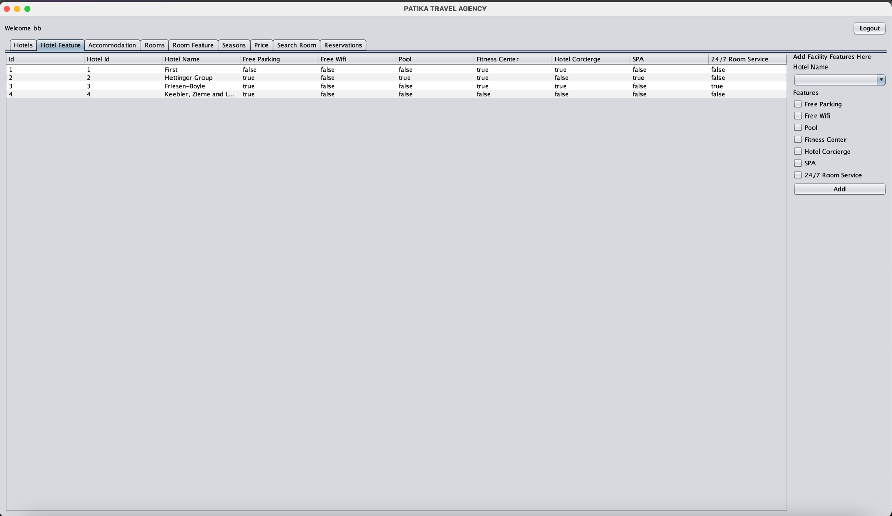

4-3 Accommodation

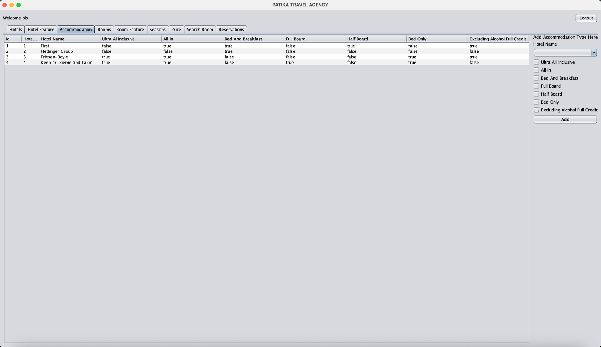

4-4 Rooms

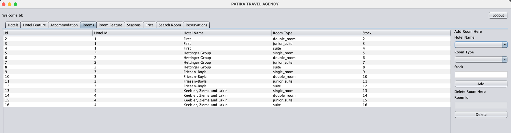

4-5 Room Feature

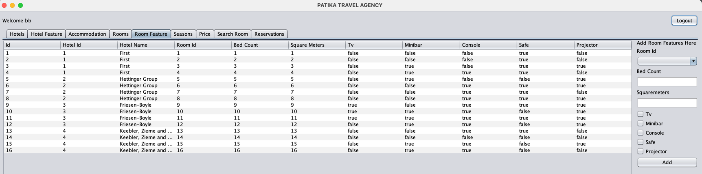

4-6 Seasons

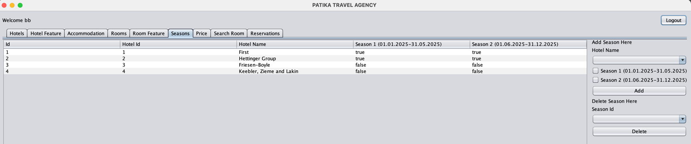

4-7 Price

4-8 Search Room Panel

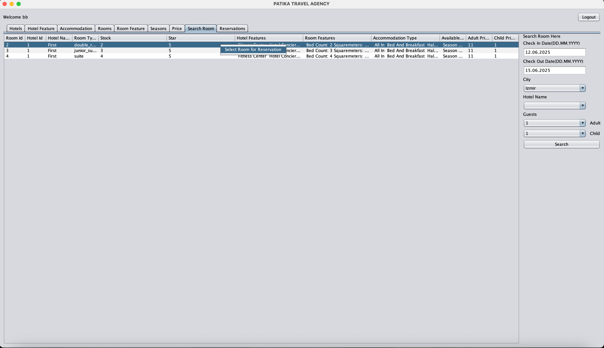

4-9 Reservation Panel (Added Reservations)

5-Reservation Panel

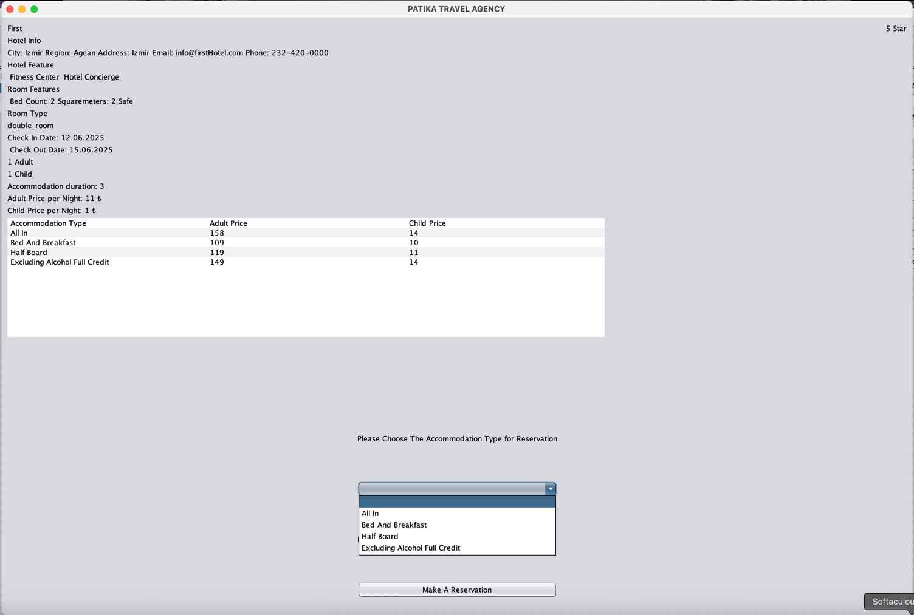

6-1 Confirmation Panel

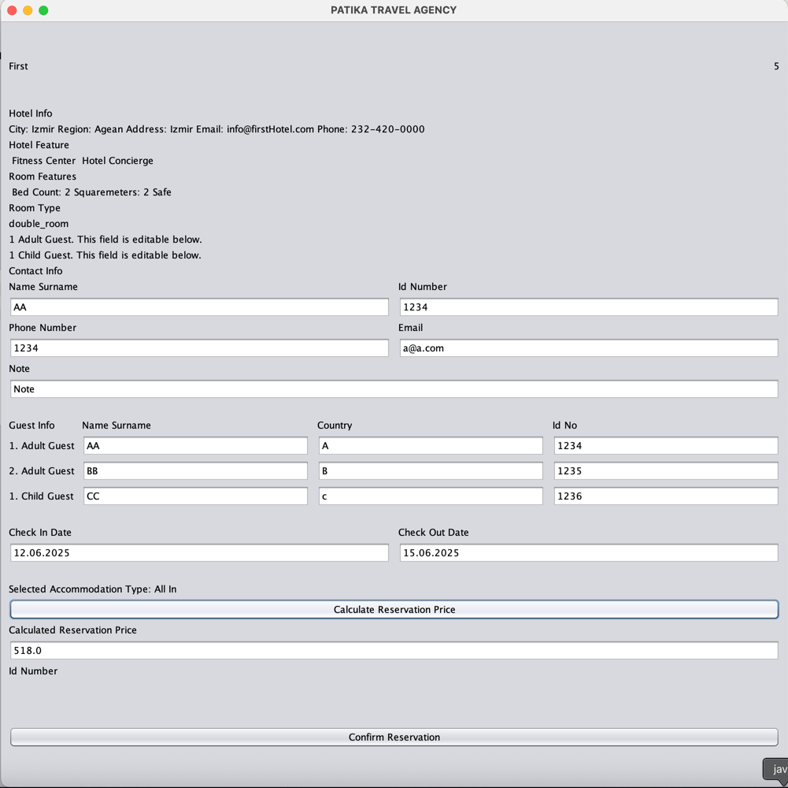

6-2 Room Already Reserved On Selected Dates

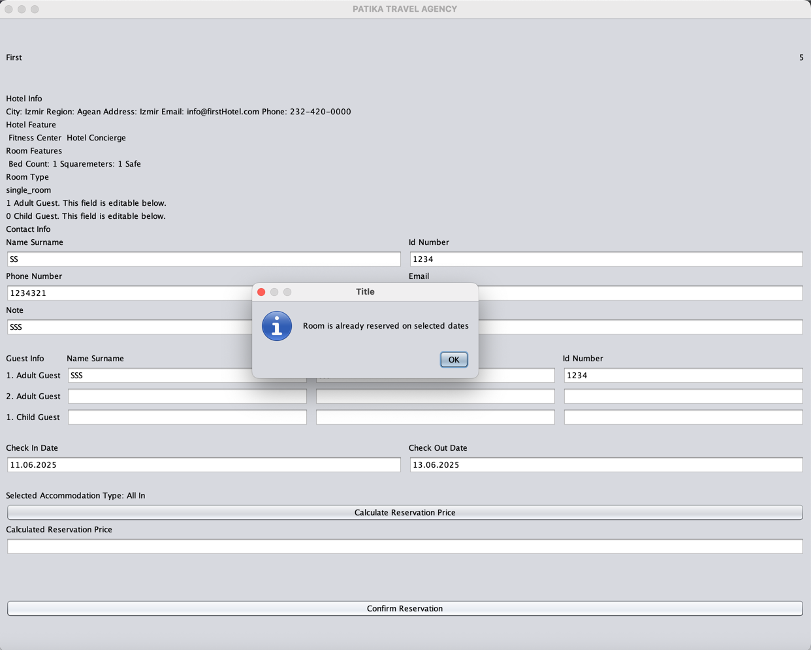

6-3 Room Capacity Low

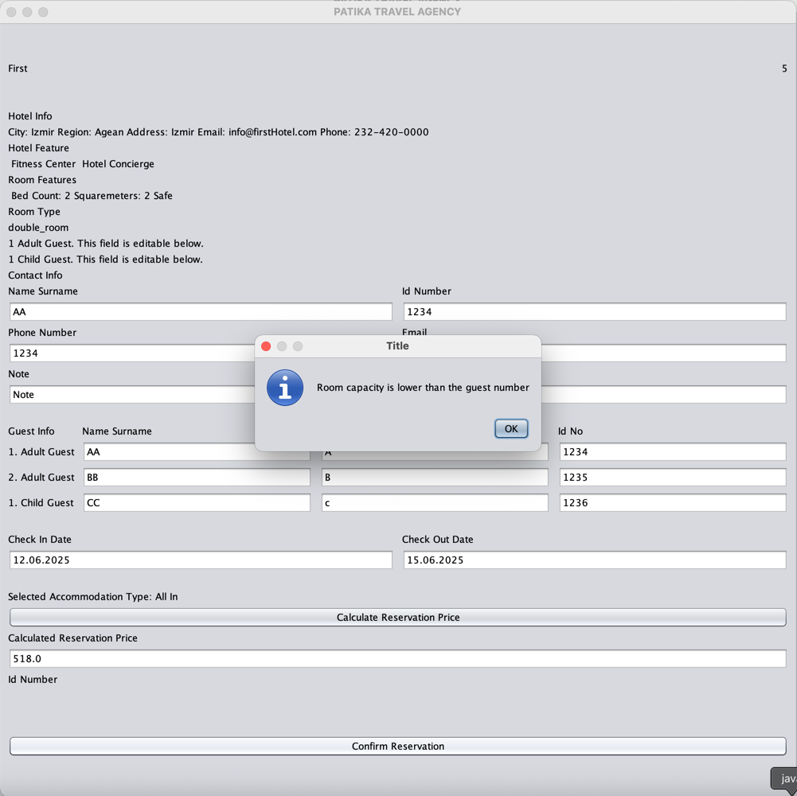

6-4 Reservation Confirmed

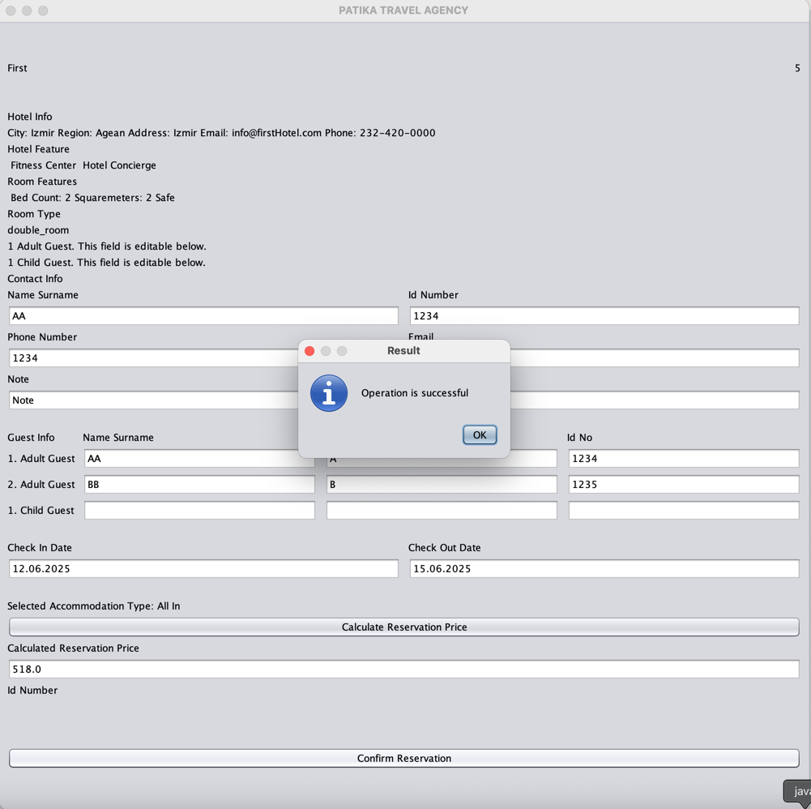
