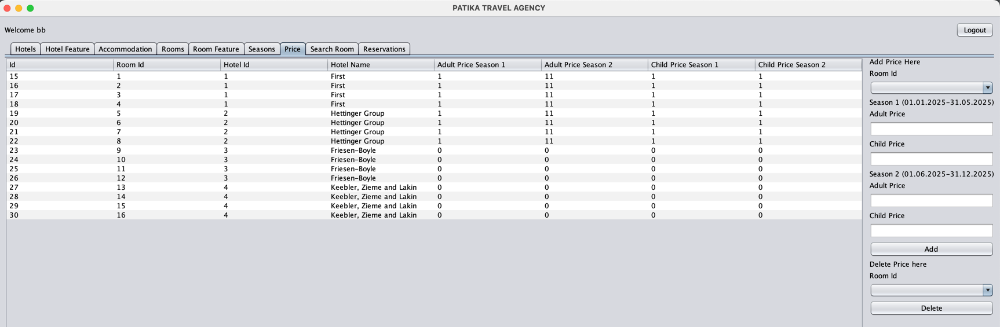
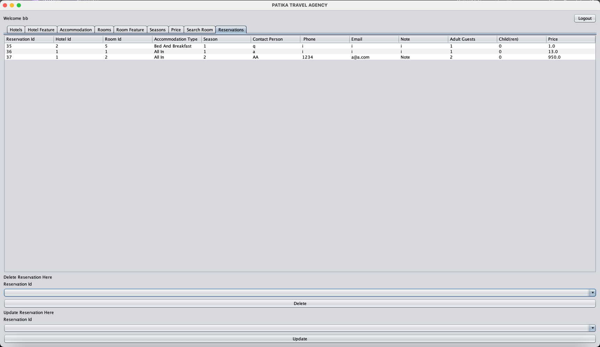

Patika.dev 
Java 102 Project Tourism Agency

1-Login Screen

2-User Not Found

3-Admin Panel

4-Staff Panel

4-1 Hotel

4-2 Hotel Features

4-3 Accommodation

4-4 Rooms

4-5 Room Feature

4-6 Seasons

4-7 Price

4-8 Search Room Panel

4-9 Reservation Panel (Added Reservations)

5-Reservation Panel

6-1 Confirmation Panel

6-2 Room Already Reserved On Selected Dates

6-3 Room Capacity Low

6-4 Reservation Confirmed

